# Technical Architecture Guide

This document provides a comprehensive overview of bolt.diy's technical architecture, system design, and component interactions.

## 🏗️ System Overview

bolt.diy is built as a modern web application that brings AI-powered development tools directly to the browser. The system consists of several key layers working together to provide a seamless development experience.

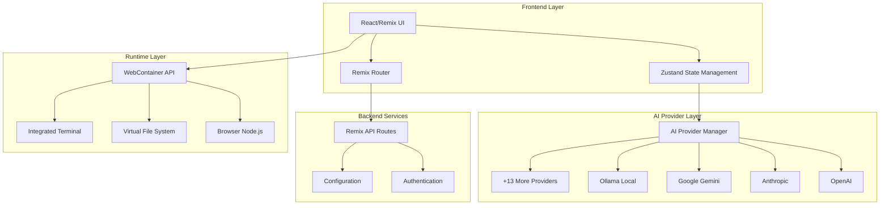

## 🎯 Core Components

### Frontend Architecture

The frontend is built with React and Remix, providing a modern, server-side rendered application with excellent performance and SEO.

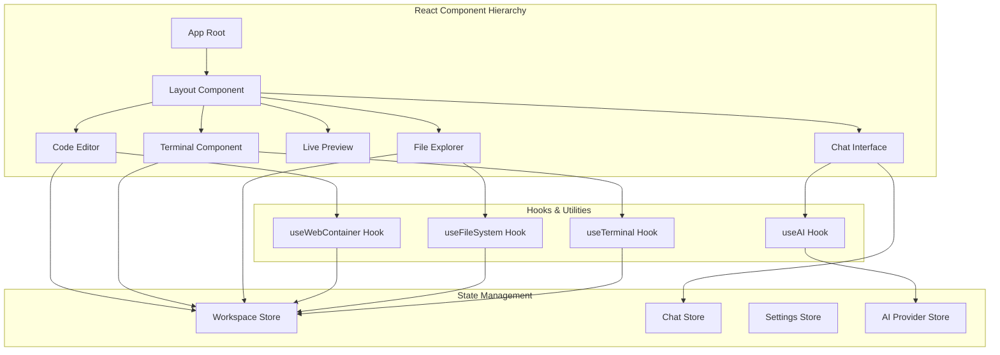

### AI Provider Integration

bolt.diy supports multiple AI providers through a unified interface, allowing users to choose their preferred AI service.

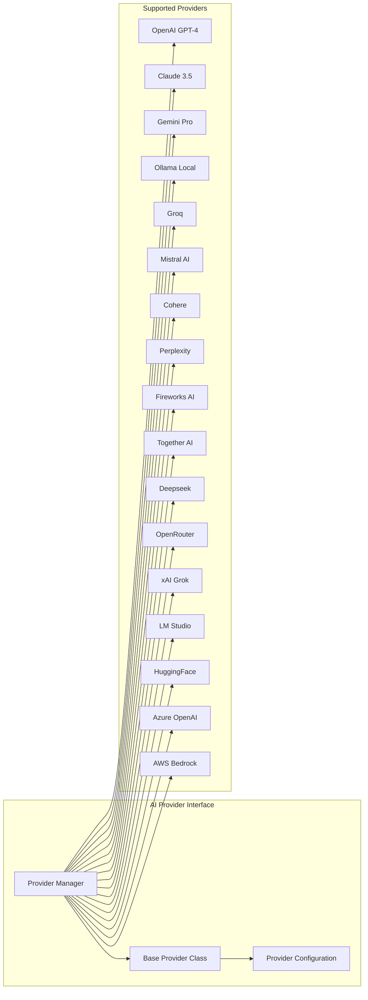

### WebContainer Integration

The WebContainer API enables a full Node.js runtime environment directly in the browser, providing file system access, terminal capabilities, and package management.

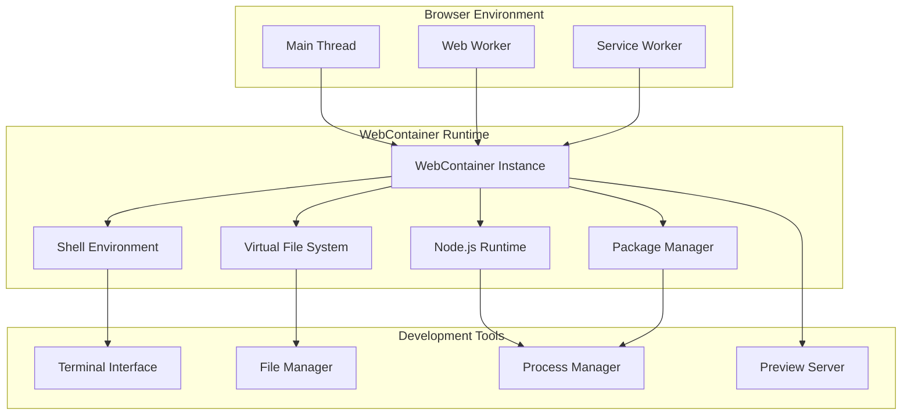

## 🔄 Data Flow & Communication

### Request/Response Flow

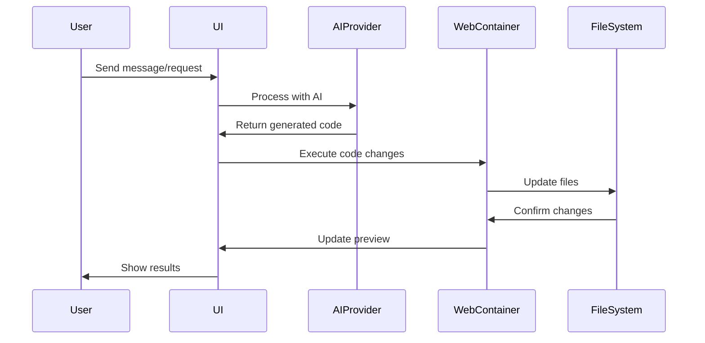

### File Management Flow

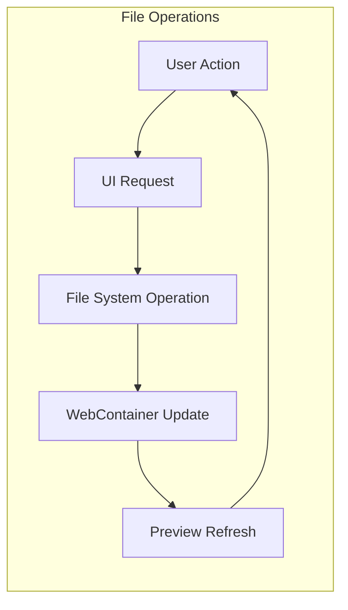

## 🚀 Technology Stack

### Frontend Technologies

- **React 18**: Modern React with concurrent features
- **Remix**: Full-stack React framework with SSR/SSG
- **TypeScript**: Type-safe development
- **Vite**: Fast build tool and development server
- **UnoCSS**: Instant atomic CSS engine
- **Zustand**: Lightweight state management
- **Monaco Editor**: VS Code editor experience
- **WebContainer API**: Browser-based Node.js runtime

### AI & Machine Learning

- **Multiple LLM Providers**: 17+ supported AI providers
- **Streaming Responses**: Real-time AI response streaming
- **Context Management**: Conversation history and context
- **Code Generation**: AI-powered code creation and editing
- **Natural Language Processing**: Intent understanding and parsing

### Development & Build Tools

- **pnpm**: Fast, efficient package manager
- **ESLint**: Code linting and quality checks
- **Prettier**: Code formatting
- **Husky**: Git hooks for quality control
- **TypeScript**: Static type checking
- **Electron**: Desktop application wrapper

### Deployment & Infrastructure

- **Vercel**: Web deployment platform
- **Docker**: Containerization support
- **GitHub Pages**: Documentation hosting
- **Cloudflare Workers**: Edge computing support
- **Netlify**: Alternative deployment option

## 🔒 Security Considerations

### Browser Security

- **Sandboxed Execution**: WebContainer provides isolated runtime
- **Content Security Policy**: CSP headers for XSS protection  
- **CORS Configuration**: Proper cross-origin resource sharing
- **Input Validation**: Sanitization of user inputs and AI responses

### AI Provider Security

- **API Key Management**: Secure storage and transmission
- **Rate Limiting**: Protection against API abuse
- **Response Filtering**: Content moderation and safety checks
- **Data Privacy**: Conversations and code stay in browser

### Code Execution Security

- **Isolated Environment**: Code runs in WebContainer sandbox
- **File System Restrictions**: Limited access to browser file system
- **Network Isolation**: Controlled external resource access
- **Process Isolation**: Separate processes for different operations

## ⚡ Performance Optimization

### Frontend Performance

- **Code Splitting**: Lazy loading of components and routes
- **Bundle Optimization**: Tree shaking and minification
- **Caching Strategies**: Browser and CDN caching
- **Progressive Enhancement**: Core functionality without JavaScript

### Runtime Performance

- **Memory Management**: Efficient WebContainer resource usage
- **Stream Processing**: Real-time response handling
- **Background Tasks**: Web Workers for heavy operations
- **Virtual Scrolling**: Efficient rendering of large file lists

### AI Response Optimization

- **Streaming Responses**: Immediate feedback during generation
- **Context Optimization**: Efficient prompt engineering
- **Caching**: Response caching for repeated requests
- **Parallel Processing**: Multiple AI requests when beneficial

## 🔧 Configuration & Customization

### Environment Configuration

```typescript
interface AppConfig {
  // AI Provider settings
  providers: {
    openai?: { apiKey: string; model: string; }
    anthropic?: { apiKey: string; model: string; }
    google?: { apiKey: string; model: string; }
    // ... other providers
  }
  
  // WebContainer settings
  webContainer: {
    memoryLimit: number
    cpuLimit: number
    networkAccess: boolean
  }
  
  // UI preferences
  ui: {
    theme: 'light' | 'dark' | 'system'
    codeTheme: string
    fontSize: number
    layout: 'default' | 'compact'
  }
}
```

### Provider Configuration

Each AI provider can be configured with specific settings:

```typescript
interface ProviderConfig {
  name: string
  apiKey: string
  model: string
  maxTokens?: number
  temperature?: number
  topP?: number
  frequencyPenalty?: number
  presencePenalty?: number
}
```

## 🏭 Build & Deployment Architecture

### Development Build

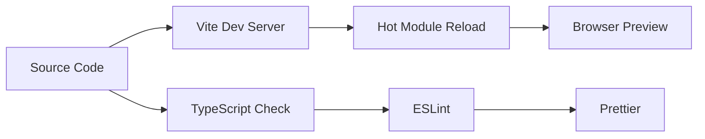

### Production Build

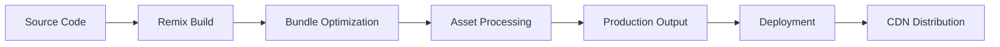

### Deployment Options

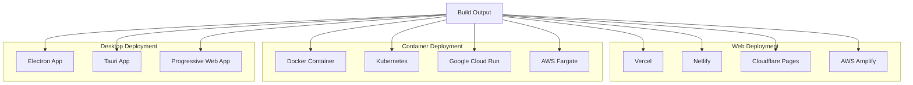

## 🔄 State Management Architecture

### Global State Structure

```mermaid
graph TB
    subgraph "Application State"
        WorkspaceState[Workspace State]
        ChatState[Chat State]
        SettingsState[Settings State]
        UIState[UI State]
    end
    
    subgraph "Workspace State"
        Files[File Tree]
        ActiveFile[Active File]
        PreviewUrl[Preview URL]
        Terminal[Terminal State]
    end
    
    subgraph "Chat State"
        Messages[Message History]
        ActiveProvider[AI Provider]
        StreamingState[Streaming State]
        Context[Conversation Context]
    end
    
    subgraph "Settings State"
        Theme[Theme Settings]
        Providers[Provider Config]
        UserPrefs[User Preferences]
        APIKeys[API Keys]
    end
    
    WorkspaceState --> Files
    WorkspaceState --> ActiveFile
    WorkspaceState --> PreviewUrl
    WorkspaceState --> Terminal
    
    ChatState --> Messages
    ChatState --> ActiveProvider
    ChatState --> StreamingState
    ChatState --> Context
    
    SettingsState --> Theme
    SettingsState --> Providers
    SettingsState --> UserPrefs
    SettingsState --> APIKeys
```

## 🌐 Extensibility & Plugins

### Extension Points

- **AI Providers**: Add custom AI provider implementations
- **File Types**: Support for new file types and languages
- **Themes**: Custom UI and editor themes
- **Templates**: Project templates and scaffolding
- **Deployment Targets**: Additional deployment platforms

### Plugin Architecture

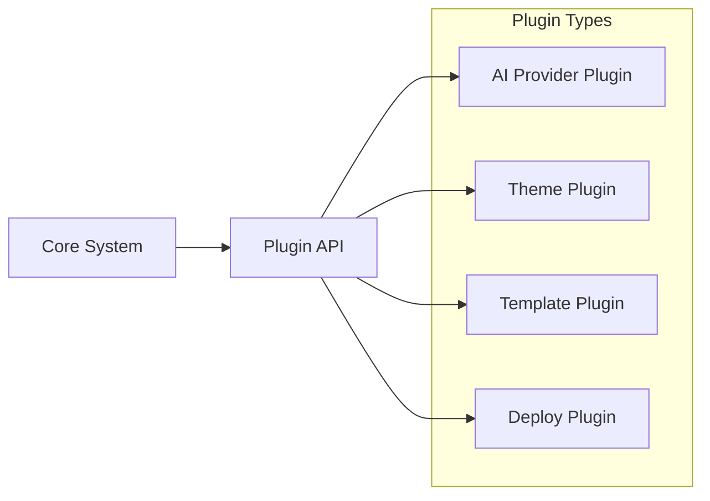

## 🔍 Monitoring & Analytics

### Performance Monitoring

- **Core Web Vitals**: LCP, FID, CLS tracking
- **Bundle Analysis**: Size and performance metrics
- **Runtime Performance**: Memory and CPU usage
- **Error Tracking**: Exception monitoring and reporting

### Usage Analytics

- **Feature Usage**: Component and feature adoption
- **AI Provider Performance**: Response times and success rates
- **User Flows**: Common usage patterns and workflows
- **Performance Metrics**: Build times and deployment success

This architecture provides a robust, scalable foundation for AI-powered web development in the browser, with clear separation of concerns and extensibility for future enhancements.