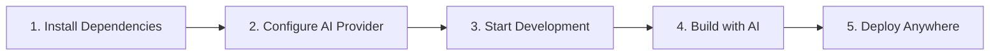
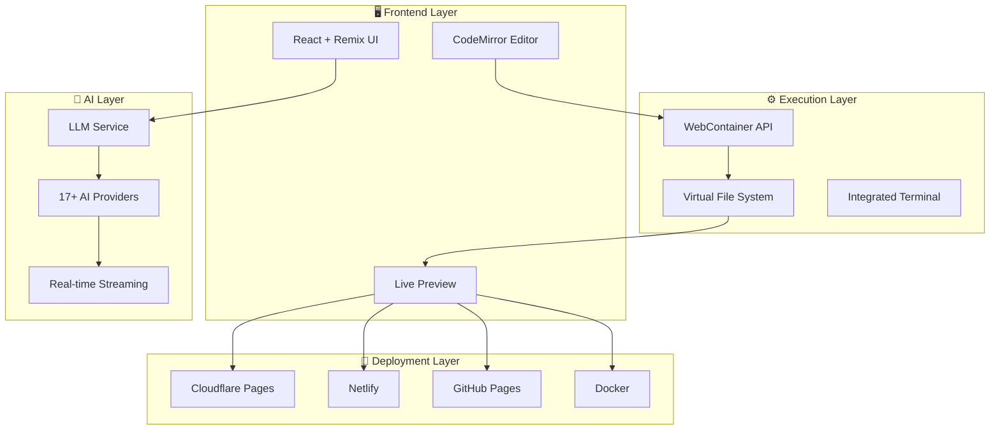
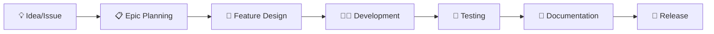
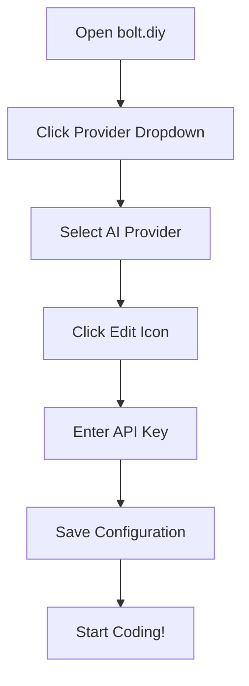

# bolt.diy

[](https://bolt.diy)

**bolt.diy** is the official open-source version of Bolt.new - a revolutionary AI-powered full-stack web development platform that runs entirely in your browser. Build, test, and deploy complete web applications using natural language conversations with advanced AI models.

## 🌟 What Makes bolt.diy Special?

- **🧠 Multi-AI Provider Support**: Choose from 17+ AI providers including OpenAI, Anthropic, Google Gemini, Ollama, and more
- **🌐 Browser-Based Runtime**: Full Node.js environment running securely in your browser via WebContainer API
- **⚡ Real-Time Development**: Live preview, instant feedback, and streaming code generation
- **🔧 Complete Toolchain**: Integrated terminal, file manager, Git support, and deployment tools
- **🔒 Privacy-First**: Your code and conversations stay in your browser
- **📱 Cross-Platform**: Web app, desktop (Electron), and deployment to multiple platforms

## 🎯 Perfect For

- **Rapid Prototyping**: Turn ideas into working applications in minutes
- **Learning & Education**: Understand how applications are built step-by-step
- **Professional Development**: Accelerate development workflows
- **Experimentation**: Try new frameworks and technologies safely

## 📚 Documentation & Resources

- 📖 **[Official Documentation](https://stackblitz-labs.github.io/bolt.diy/)** - Complete setup and usage guide
- 🏗️ **[Technical Architecture](./ARCHITECTURE.md)** - Detailed system architecture with diagrams
- 🤝 **[Contributing Guide](./CONTRIBUTING.md)** - How to contribute to the project
- 📋 **[Project Management](./PROJECT.md)** - Development workflow and roadmap
- ❓ **[FAQ](./FAQ.md)** - Common questions and troubleshooting
- 💬 **[Community](https://thinktank.ottomator.ai)** - Join our community discussions
- 🎥 **[Video Tutorials](https://thinktank.ottomator.ai/t/videos-tutorial-helpful-content/3243)** - Video guides and tutorials
- 🤖 **[AI Assistant](https://studio.ottomator.ai/)** - Get help from our bolt.diy Expert

## 🚀 Quick Start



### Option 1: One-Click Setup (Recommended)

```bash
# Install and run
npm install -g pnpm
git clone https://github.com/stackblitz-labs/bolt.diy.git
cd bolt.diy
pnpm install
pnpm run dev
```

### Option 2: Docker (Isolated Environment)

```bash
# Build and run with Docker
docker build . --target bolt-ai-development
docker compose --profile development up
```

## 🏗️ System Architecture

bolt.diy is built with a modern, scalable architecture designed for performance and extensibility:



### 🔌 Supported AI Providers

| Provider | Status | Notes |
|----------|--------|-------|
| **OpenAI** | ✅ | GPT-4, GPT-3.5-turbo |
| **Anthropic** | ✅ | Claude 3.5 Sonnet, Claude 3 Haiku |
| **Google** | ✅ | Gemini Pro, Gemini Flash |
| **Ollama** | ✅ | Local models |
| **OpenRouter** | ✅ | Multiple models via one API |
| **xAI** | ✅ | Grok models |
| **Groq** | ✅ | Fast inference |
| **Mistral** | ✅ | Mistral models |
| **Cohere** | ✅ | Command models |
| **DeepSeek** | ✅ | Code-focused models |
| **HuggingFace** | ✅ | Open-source models |
| **LM Studio** | ✅ | Local model server |
| **Together** | ✅ | Open-source models |
| **Perplexity** | ✅ | Search-augmented |
| **AWS Bedrock** | ✅ | Enterprise models |
| **GitHub** | ✅ | GitHub Copilot |
| **Custom/OpenAI-Like** | ✅ | Any OpenAI-compatible API |

## 🎯 Core Features

### ✨ AI-Powered Development
- **Natural Language Coding**: Describe what you want to build
- **Multi-Model Support**: Switch between AI providers seamlessly
- **Context-Aware**: AI understands your entire project context
- **Streaming Responses**: Real-time code generation

### 🛠️ Integrated Development Environment
- **Advanced Code Editor**: Syntax highlighting, autocomplete, error detection
- **Live Preview**: See changes instantly in an embedded browser
- **Integrated Terminal**: Run commands and see output in real-time
- **File Manager**: Organize and manage project files

### 🔄 Version Control & Collaboration
- **Git Integration**: Clone, commit, push directly from the interface
- **Project Import**: Load existing projects from GitHub or local files
- **Change History**: Revert to previous versions easily
- **Backup & Restore**: Save and restore chat sessions

### 🚀 Deployment & Sharing
- **One-Click Deploy**: Deploy to Netlify, Cloudflare Pages, Vercel
- **GitHub Integration**: Publish directly to GitHub repositories
- **Docker Support**: Containerized deployment
- **Download Projects**: Export as ZIP files

## ✅ Community Requested Features

We've implemented many features requested by our amazing community:

### 🎉 Recently Completed Features

- ✅ **Multiple AI Providers**: OpenAI, Anthropic, Google Gemini, Ollama, and [15+ more](#-supported-ai-providers)
- ✅ **Advanced Code Editor**: CodeMirror with syntax highlighting and autocomplete
- ✅ **Live Preview**: Real-time preview of generated applications
- ✅ **Git Integration**: Clone repositories and manage version control
- ✅ **Docker Support**: Containerized deployment options
- ✅ **Project Import/Export**: Load local projects and download as ZIP
- ✅ **Terminal Integration**: See command output in real-time
- ✅ **Mobile Support**: Responsive design for mobile devices
- ✅ **Voice Input**: Speech recognition for prompts
- ✅ **Image Attachments**: Attach images to prompts for context
- ✅ **Deployment Integration**: One-click deploy to Netlify, Cloudflare, GitHub
- ✅ **Chat Backup/Restore**: Save and restore conversation history
- ✅ **Error Detection**: Automatic error detection and AI-powered fixes
- ✅ **Starter Templates**: Pre-built project templates
- ✅ **Diff View**: Visual diff viewer for code changes

### 🚧 High Priority Features (In Progress)

- ⬜ **Enhanced File Locking**: Prevent unnecessary file rewrites with smart diffing
- ⬜ **Improved LLM Prompting**: Better support for smaller language models
- ⬜ **Backend AI Agents**: Multi-step reasoning with agent workflows
- ⬜ **Advanced Error Recovery**: Smarter error handling and recovery

### 🔮 Planned Features

- ⬜ **VSCode Integration**: Native IDE extension with git-like confirmations
- ⬜ **Knowledge Base Upload**: Upload design templates and code style guides
- ⬜ **Project Planning**: AI-generated project plans in markdown
- ⬜ **Azure OpenAI**: Microsoft Azure OpenAI service integration
- ⬜ **Vertex AI**: Google Vertex AI integration
- ⬜ **Granite Models**: IBM Granite model support

### 🤝 Community Contributors

Special thanks to our contributors who made these features possible:
`@coleam00`, `@jonathands`, `@yunatamos`, `@jasonm23`, `@fabwaseem`, `@kofi-bhr`, `@zenith110`, `@ArulGandhi`, `@ZerxZ`, `@muzafferkadir`, `@aaronbolton`, `@goncaloalves`, `@ali00209`, `@milutinke`, `@karrot0`, `@ahsan3219`, `@thecodacus`, `@wonderwhy-er`, `@sidbetatester`, `@hasanraiyan`, `@SujalXplores`, `@mouimet-infinisoft`, `@qwikode`, `@atrokhym`, `@stijnus`, `@emcconnell`, `@meetpateltech`, `@kunjabijukchhe`, `@toddyclipsgg`, `@xKevIsDev`, and many more!

## Table of Contents

- [🚀 Quick Start](#-quick-start)
- [🏗️ System Architecture](#️-system-architecture)  
- [🎯 Core Features](#-core-features)
- [⚙️ Installation & Setup](#️-installation--setup)
- [🔑 API Configuration](#-api-configuration)
- [🐳 Docker Deployment](#-docker-deployment)
- [💻 Development](#-development)
- [🤝 Contributing](#-contributing)
- [📋 Project Management](#-project-management)
- [🗺️ Roadmap](#️-roadmap)
- [❓ FAQ](#-faq)
- [📄 License](#-license)

## 📖 Additional Documentation

- **[🏗️ Technical Architecture](./ARCHITECTURE.md)** - Comprehensive system architecture overview
- **📊 Technical Diagrams](./TECHNICAL_DIAGRAMS.md)** - Detailed workflow and component diagrams
- **🤝 Contributing Guide](./CONTRIBUTING.md)** - How to contribute to the project
- **📋 Project Management](./PROJECT.md)** - Development workflow and roadmap
- **❓ FAQ](./FAQ.md)** - Frequently asked questions
- **📚 Official Docs](https://stackblitz-labs.github.io/bolt.diy/)** - Complete documentation site

## 🤝 Contributing

We welcome contributions from developers of all skill levels! bolt.diy is a community-driven project.

### 🌟 How to Contribute

1. **🐛 Report Bugs**: Found an issue? [Create a bug report](https://github.com/stackblitz-labs/bolt.diy/issues)
2. **💡 Suggest Features**: Have an idea? [Request a feature](https://github.com/stackblitz-labs/bolt.diy/issues)
3. **🔧 Code Contributions**: Fork, code, test, and submit a PR
4. **📝 Documentation**: Improve docs, tutorials, and guides
5. **🎨 Design**: UI/UX improvements and design contributions

### 🚀 Getting Started with Development

```bash
# Fork and clone the repository
git clone https://github.com/your-username/bolt.diy.git
cd bolt.diy

# Install dependencies
pnpm install

# Start development server
pnpm run dev

# Run tests
pnpm test

# Lint and format code
pnpm run lint:fix
```

### 📋 Development Guidelines

- **Code Style**: Follow existing patterns and use ESLint/Prettier
- **Testing**: Write tests for new features
- **Documentation**: Update docs for any architectural changes
- **Commits**: Use conventional commit messages
- **PRs**: Keep PRs focused and include clear descriptions

For detailed guidelines, see our [Contributing Guide](CONTRIBUTING.md).

## 📋 Project Management

bolt.diy follows a community-driven development approach with transparent project management.

### 🎯 Current Focus Areas

1. **🔧 Core Stability**: Improving reliability and performance
2. **🤖 AI Integration**: Enhanced prompt engineering and model support  
3. **🚀 Deployment**: Streamlined deployment workflows
4. **📱 Mobile**: Better mobile browser support
5. **🔌 Extensions**: Plugin system for custom integrations

### 📊 Development Process



For more details, see our [Project Management Guide](PROJECT.md).

## 🗺️ Roadmap

Explore our development roadmap and upcoming features:

**[🗺️ Interactive Roadmap](https://roadmap.sh/r/ottodev-roadmap-2ovzo)**

### 🎯 Near-term Goals (Q1 2024)

- [ ] **Improved Prompting**: Better support for smaller LLMs
- [ ] **Agent Architecture**: Backend agents vs single model calls  
- [ ] **File Locking**: Prevent unnecessary file rewrites
- [ ] **Mobile Optimization**: Enhanced mobile browser experience

### 🔮 Long-term Vision

- [ ] **VSCode Integration**: Native IDE integration
- [ ] **Collaborative Editing**: Real-time collaboration features
- [ ] **Knowledge Base**: Upload documents for context
- [ ] **Advanced AI Agents**: Multi-step reasoning and planning

---

## ❓ FAQ

### 🤔 Common Questions

**Q: Which AI provider should I use?**
A: For best results, we recommend Claude 3.5 Sonnet (Anthropic) or GPT-4 (OpenAI). For local development, try Ollama with Llama 3.

**Q: Can I use bolt.diy offline?**
A: Partially. The app works offline for editing existing projects, but AI features require an internet connection.

**Q: Is there a cost to use bolt.diy?**
A: bolt.diy is free and open-source. You only pay for the AI provider API usage you choose.

**Q: Can I deploy my projects to production?**
A: Yes! bolt.diy generates standard web applications that can be deployed anywhere.

For more detailed answers, visit our [FAQ Page](FAQ.md).

---

## Requested Additions

- ✅ OpenRouter Integration (@coleam00)
- ✅ Gemini Integration (@jonathands)
- ✅ Autogenerate Ollama models from what is downloaded (@yunatamos)
- ✅ Filter models by provider (@jasonm23)
- ✅ Download project as ZIP (@fabwaseem)
- ✅ Improvements to the main bolt.new prompt in `app\lib\.server\llm\prompts.ts` (@kofi-bhr)
- ✅ DeepSeek API Integration (@zenith110)
- ✅ Mistral API Integration (@ArulGandhi)
- ✅ "Open AI Like" API Integration (@ZerxZ)
- ✅ Ability to sync files (one way sync) to local folder (@muzafferkadir)
- ✅ Containerize the application with Docker for easy installation (@aaronbolton)
- ✅ Publish projects directly to GitHub (@goncaloalves)
- ✅ Ability to enter API keys in the UI (@ali00209)
- ✅ xAI Grok Beta Integration (@milutinke)
- ✅ LM Studio Integration (@karrot0)
- ✅ HuggingFace Integration (@ahsan3219)
- ✅ Bolt terminal to see the output of LLM run commands (@thecodacus)
- ✅ Streaming of code output (@thecodacus)
- ✅ Ability to revert code to earlier version (@wonderwhy-er)
- ✅ Chat history backup and restore functionality (@sidbetatester)
- ✅ Cohere Integration (@hasanraiyan)
- ✅ Dynamic model max token length (@hasanraiyan)
- ✅ Better prompt enhancing (@SujalXplores)
- ✅ Prompt caching (@SujalXplores)
- ✅ Load local projects into the app (@wonderwhy-er)
- ✅ Together Integration (@mouimet-infinisoft)
- ✅ Mobile friendly (@qwikode)
- ✅ Better prompt enhancing (@SujalXplores)
- ✅ Attach images to prompts (@atrokhym)(@stijnus)
- ✅ Added Git Clone button (@thecodacus)
- ✅ Git Import from url (@thecodacus)
- ✅ PromptLibrary to have different variations of prompts for different use cases (@thecodacus)
- ✅ Detect package.json and commands to auto install & run preview for folder and git import (@wonderwhy-er)
- ✅ Selection tool to target changes visually (@emcconnell)
- ✅ Detect terminal Errors and ask bolt to fix it (@thecodacus)
- ✅ Detect preview Errors and ask bolt to fix it (@wonderwhy-er)
- ✅ Add Starter Template Options (@thecodacus)
- ✅ Perplexity Integration (@meetpateltech)
- ✅ AWS Bedrock Integration (@kunjabijukchhe)
- ✅ Add a "Diff View" to see the changes (@toddyclipsgg)
- ⬜ **HIGH PRIORITY** - Prevent bolt from rewriting files as often (file locking and diffs)
- ⬜ **HIGH PRIORITY** - Better prompting for smaller LLMs (code window sometimes doesn't start)
- ⬜ **HIGH PRIORITY** - Run agents in the backend as opposed to a single model call
- ✅ Deploy directly to Netlify (@xKevIsDev)
- ✅ Supabase Integration (@xKevIsDev)
- ⬜ Have LLM plan the project in a MD file for better results/transparency
- ⬜ VSCode Integration with git-like confirmations
- ⬜ Upload documents for knowledge - UI design templates, a code base to reference coding style, etc.
- ✅ Voice prompting
- ⬜ Azure Open AI API Integration
- ⬜ Vertex AI Integration
- ⬜ Granite Integration
- ✅ Popout Window for Web Container(@stijnus)
- ✅ Ability to change Popout window size (@stijnus)

## ⚙️ Installation & Setup

### 🖥️ System Requirements

| Requirement | Minimum | Recommended |
|-------------|---------|-------------|
| **Node.js** | 18.18.0+ | 20.0.0+ |
| **RAM** | 4GB | 8GB+ |
| **Storage** | 2GB | 5GB+ |
| **Browser** | Chrome 90+ | Chrome/Edge Latest |

### 📥 Installation Options

#### Option 1: Quick Setup (Recommended)

```bash
# Download latest release
wget https://github.com/stackblitz-labs/bolt.diy/archive/refs/heads/stable.zip
unzip stable.zip && cd bolt.diy-stable

# Install dependencies and start
npm install -g pnpm
pnpm install
pnpm run dev
```

#### Option 2: Git Clone (For Contributors)

```bash
# Clone repository
git clone -b stable https://github.com/stackblitz-labs/bolt.diy.git
cd bolt.diy

# Install and run
pnpm install
pnpm run dev
```

#### Option 3: Development Branch (Bleeding Edge)

```bash
# Get latest features (may be unstable)
git clone https://github.com/stackblitz-labs/bolt.diy.git
cd bolt.diy
git checkout main
pnpm install
pnpm run dev
```

### 🚀 First Run

1. **Open your browser** to `http://localhost:5173`
2. **Configure API keys** (see next section)
3. **Start building** with AI!

## 🔑 API Configuration

bolt.diy requires API keys from your chosen AI providers. All keys are stored securely in your browser only.

### 🎯 Recommended Providers for Beginners

1. **Anthropic Claude** (Best overall experience)
   - Sign up at [console.anthropic.com](https://console.anthropic.com)
   - Get API key and add to bolt.diy settings

2. **OpenAI GPT-4** (Excellent code generation)
   - Sign up at [platform.openai.com](https://platform.openai.com)
   - Create API key and configure in bolt.diy

### ⚙️ Configuration Steps



### 🔐 API Key Management

- **🔒 Browser Only**: Keys never leave your browser
- **🚫 No Server Storage**: We don't store or log your keys
- **🔄 Easy Switching**: Change providers anytime
- **⚡ Instant Setup**: No account creation required

### 🏠 Local Provider Setup

For **Ollama** or **LM Studio**:

1. **Install locally**:
   ```bash
   # Ollama
   curl -fsSL https://ollama.ai/install.sh | sh
   ollama pull llama3
   
   # LM Studio - Download from lmstudio.ai
   ```

2. **Configure base URL** in bolt.diy settings:
   - Ollama: `http://localhost:11434`
   - LM Studio: `http://localhost:1234`

## 🐳 Docker Deployment

### 🏗️ Development Environment

```bash
# Build development image
docker build . --target bolt-ai-development

# Run with compose
docker compose --profile development up
```

### 🚀 Production Environment

```bash
# Build production image
docker build . --target bolt-ai-production

# Run production container
docker run -p 5173:5173 --env-file .env.local bolt-ai:production
```

### ☁️ Cloud Deployment with Coolify

1. **Import repository** to Coolify
2. **Select Docker Compose** build pack
3. **Configure environment** variables
4. **Set start command**:
   ```bash
   docker compose --profile production up
   ```

## 💻 Development

### 🛠️ Available Scripts

| Command | Description |
|---------|-------------|
| `pnpm run dev` | Start development server |
| `pnpm run build` | Build for production |
| `pnpm run preview` | Preview production build |
| `pnpm test` | Run test suite |
| `pnpm run typecheck` | TypeScript type checking |
| `pnpm run lint` | Lint code |
| `pnpm run lint:fix` | Fix linting issues |
| `pnpm run deploy` | Deploy to Cloudflare Pages |

### 🧪 Testing

```bash
# Run all tests
pnpm test

# Run tests in watch mode
pnpm run test:watch

# Run type checking
pnpm run typecheck
```

### 📦 Building

```bash
# Development build
pnpm run build

# Production build with optimizations
NODE_ENV=production pnpm run build
```


## 📄 License

### 📝 Source Code License

bolt.diy source code is licensed under the **MIT License** - see the [LICENSE](LICENSE) file for details.

### ⚠️ WebContainer API License

**Important**: bolt.diy uses the WebContainer API, which requires a [commercial license](https://webcontainers.io/enterprise) for production use in commercial, for-profit settings.

**Who needs a commercial license?**
- ✅ **Free**: Personal projects, learning, open-source development
- ✅ **Free**: Internal company tools and prototypes  
- ❌ **License Required**: Commercial products serving customers
- ❌ **License Required**: SaaS applications using WebContainer

For more details, visit [WebContainers Enterprise](https://webcontainers.io/enterprise).

---

## 🙏 Acknowledgments

bolt.diy was originally created by [Cole Medin](https://www.youtube.com/@ColeMedin) and has grown into a massive community effort. Special thanks to all our contributors who have made this project possible!

### 🌟 Community & Support

- **💬 Join our community**: [oTTomator Think Tank](https://thinktank.ottomator.ai)
- **🎥 Video tutorials**: [Community Resources](https://thinktank.ottomator.ai/t/videos-tutorial-helpful-content/3243)  
- **🤖 AI Assistant**: [bolt.diy Expert](https://studio.ottomator.ai/)
- **⭐ Star the repo**: Help others discover bolt.diy!

---

**Happy coding with AI! 🚀✨**
