# Technical Diagrams & Workflow Documentation

This document provides detailed technical diagrams and workflow documentation for bolt.diy, covering user experience flows, component architecture, AI integration, and system operations.

## 🚀 User Experience Flow Diagrams

### Complete User Development Journey

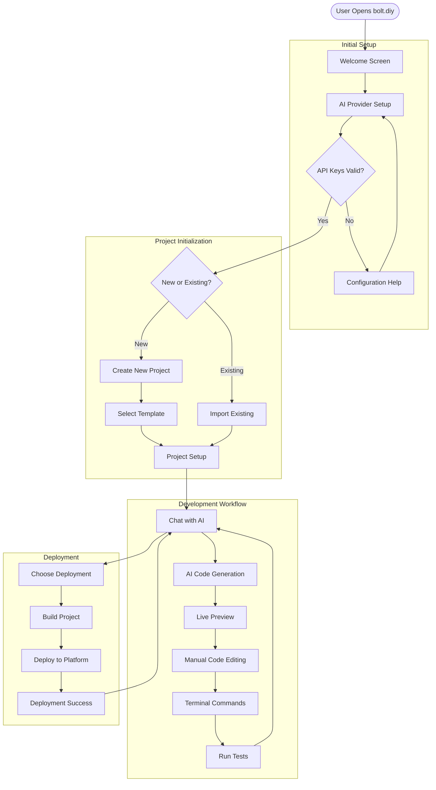

### AI-Assisted Development Workflow

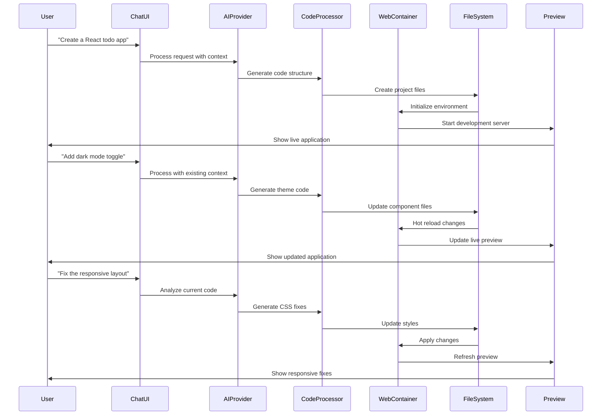

## 🏗️ Component Architecture Diagrams

### React Component Hierarchy

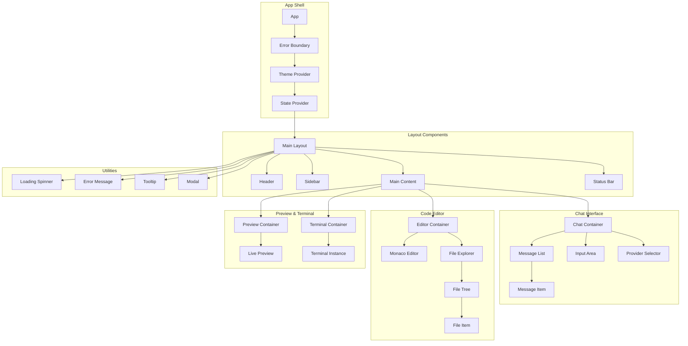

### State Flow & Props Architecture

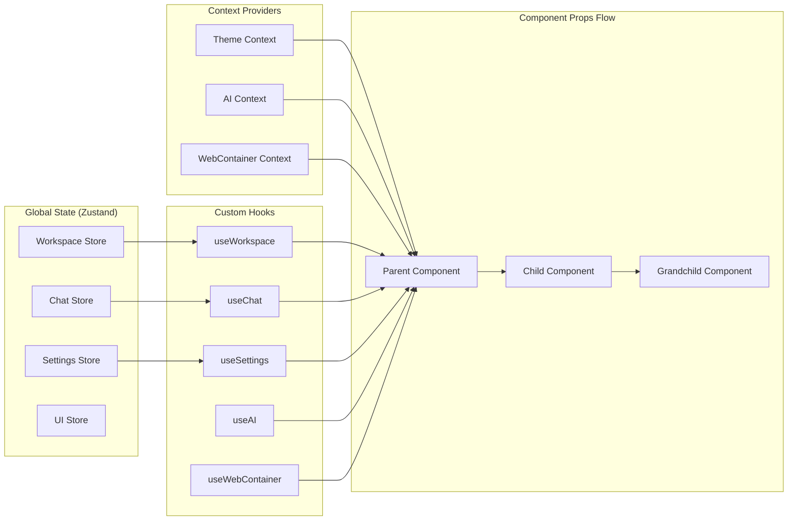

## 🤖 AI Provider Integration Diagrams

### AI Provider Registration & Management

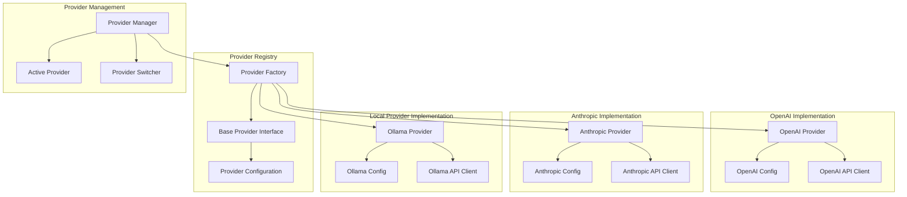

### AI Request Processing Pipeline

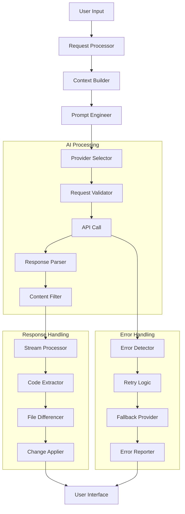

### Multi-Provider Response Aggregation

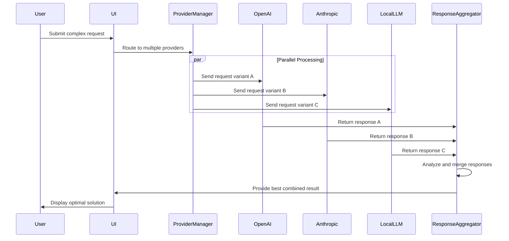

## 🗂️ File System Operations

### Virtual File System Architecture

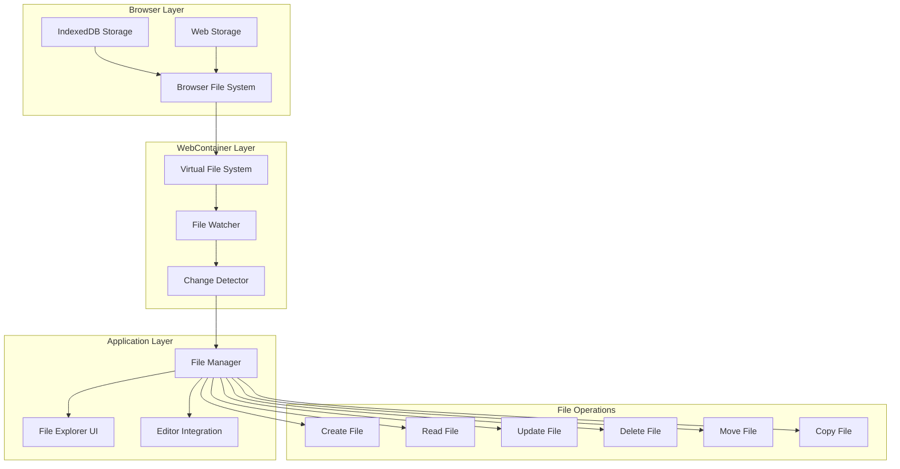

### File Change Processing Pipeline

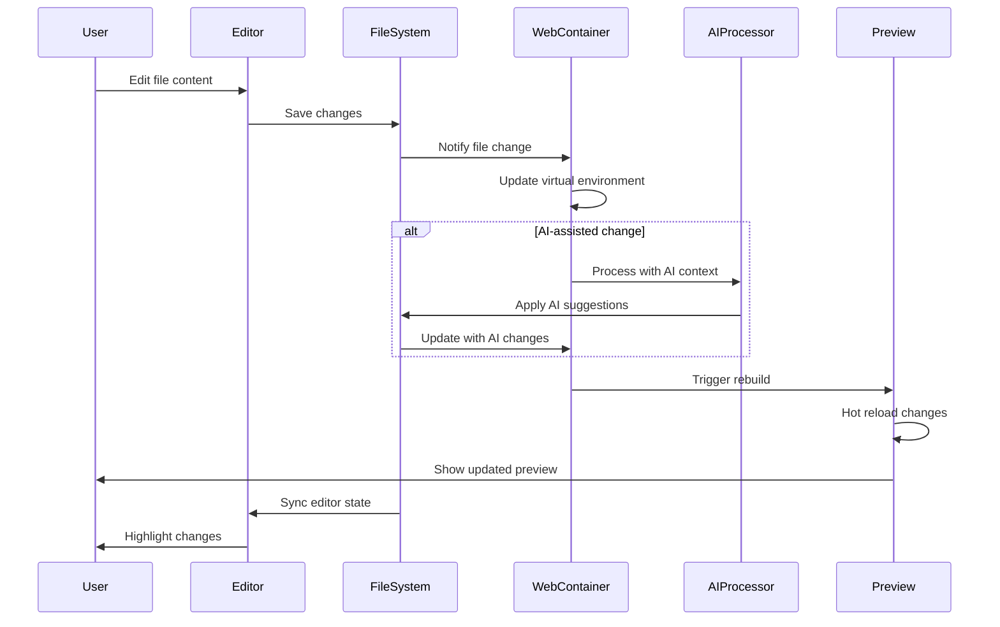

## ⚙️ WebContainer Lifecycle Management

### Container Initialization Flow

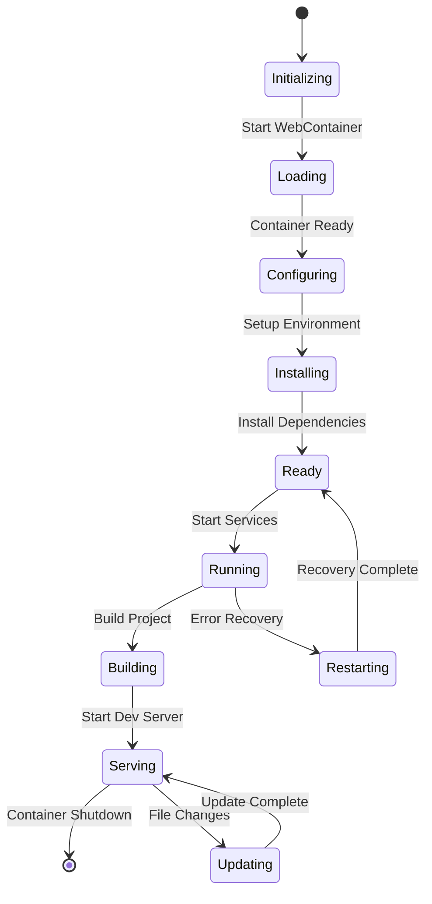

### Process & Service Management

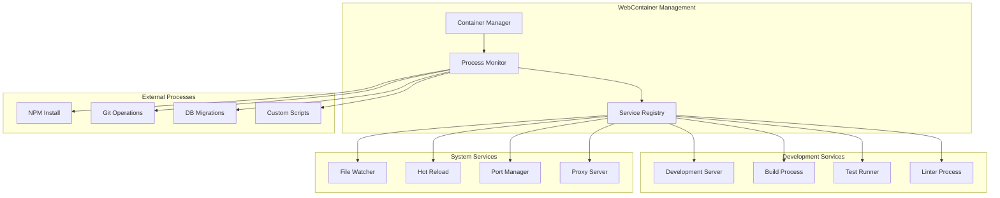

## 🚀 Deployment Pipeline Workflows

### Multi-Platform Deployment Matrix

```mermaid
graph TB
    BuildOutput[Build Output]
    
    subgraph "Static Site Deployment"
        Vercel[Vercel]
        Netlify[Netlify]
        CloudflarePages[Cloudflare Pages]
        GitHubPages[GitHub Pages]
        AWSAmplify[AWS Amplify]
    end
    
    subgraph "Container Deployment"
        DockerHub[Docker Hub]
        CloudRun[Google Cloud Run]
        AWSFargate[AWS Fargate]
        AzureContainers[Azure Containers]
        DigitalOcean[DigitalOcean Apps]
    end
    
    subgraph "Server Deployment"
        VPS[VPS/Dedicated Server]
        Heroku[Heroku]
        Railway[Railway]
        Render[Render]
    end
    
    subgraph "Edge Deployment"
        CloudflareWorkers[Cloudflare Workers]
        AWSLambda[AWS Lambda]
        VercelEdge[Vercel Edge Functions]
        NetlifyEdge[Netlify Edge Functions]
    end
    
    BuildOutput --> Vercel
    BuildOutput --> Netlify
    BuildOutput --> CloudflarePages
    BuildOutput --> GitHubPages
    BuildOutput --> AWSAmplify
    
    BuildOutput --> DockerHub
    BuildOutput --> CloudRun
    BuildOutput --> AWSFargate
    BuildOutput --> AzureContainers
    BuildOutput --> DigitalOcean
    
    BuildOutput --> VPS
    BuildOutput --> Heroku
    BuildOutput --> Railway
    BuildOutput --> Render
    
    BuildOutput --> CloudflareWorkers
    BuildOutput --> AWSLambda
    BuildOutput --> VercelEdge
    BuildOutput --> NetlifyEdge
```

### Deployment Workflow Automation

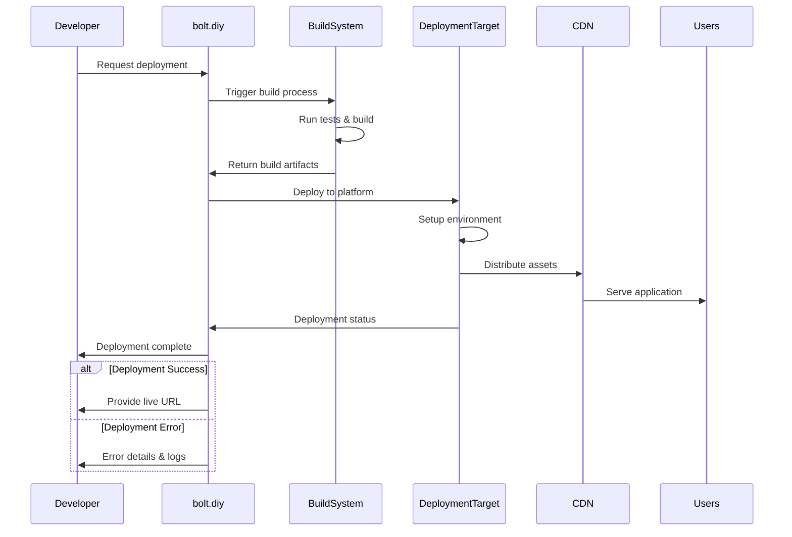

## 🔧 Error Handling & Recovery

### Error Classification & Handling Strategy

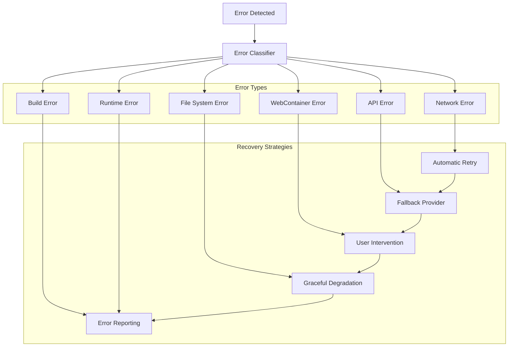

### Error Recovery Flow

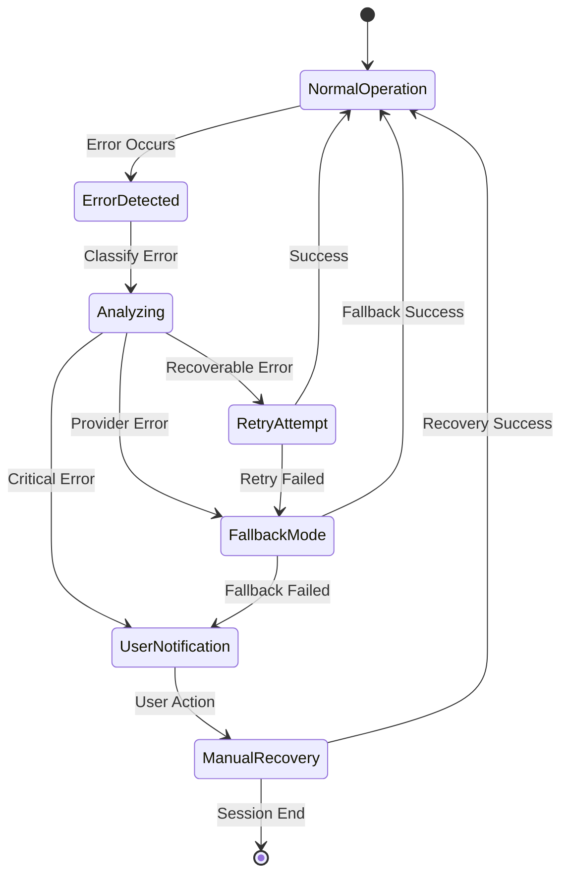

## 📊 State Management & Synchronization

### Global State Architecture

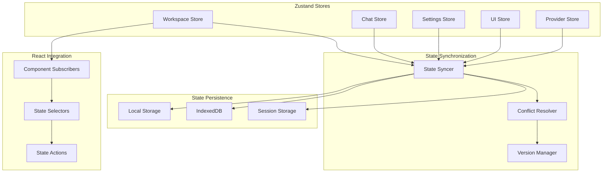

### Real-time State Updates

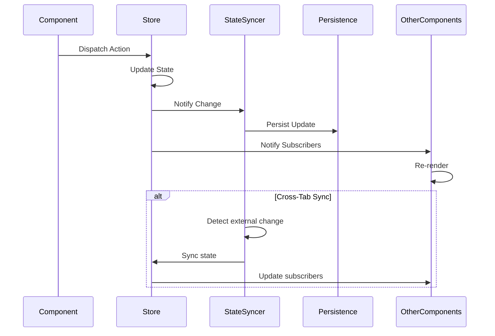

## 🔌 Extension & Plugin Architecture

### Plugin System Design

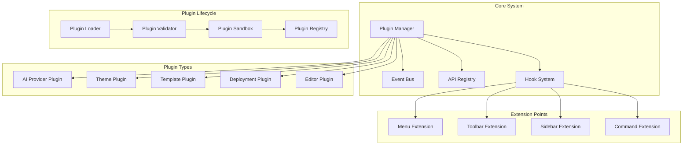

### Plugin Communication Flow

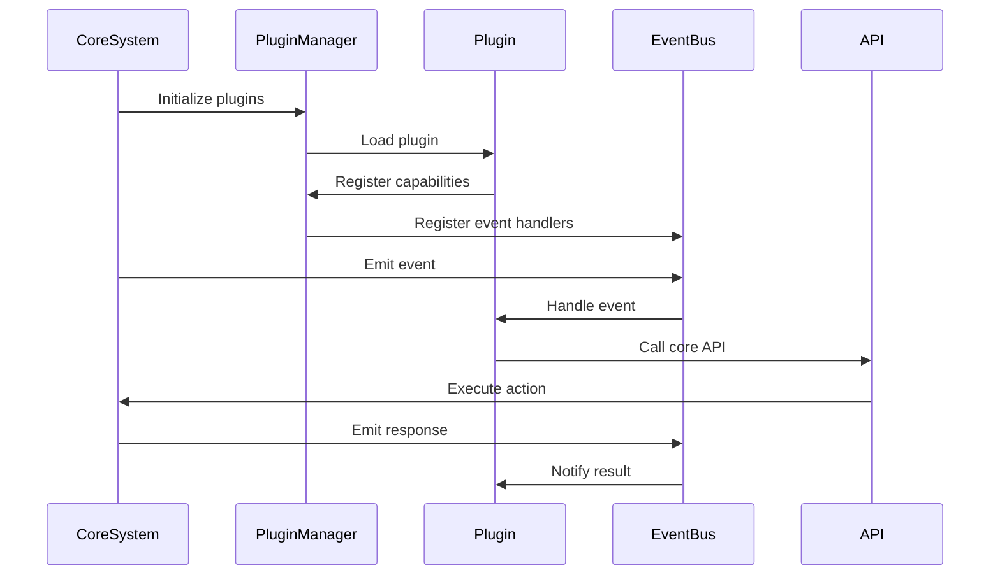

This comprehensive technical documentation provides detailed insights into bolt.diy's architecture, workflows, and system design, enabling developers and contributors to understand and extend the platform effectively.